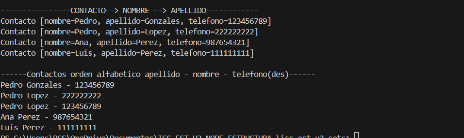

# 🧠 PRACTICA DE SETS 

**Autor:** Andrés Cajas  

**Tema:** Colecciones Java - Implementación de `Set` con sus distintas variantes

**Profesor:** Ing.Pablo Torres

**Fecha:** 21/07/2025

**Carrera :** Computacion

---

## 📌 Objetivo

Demostrar el uso práctico y conceptual de las colecciones tipo `Set` en Java, a través de ejemplos implementados con `HashSet`, `LinkedHashSet`, `TreeSet` y `TreeSet` con comparadores personalizados.

---

## 🗂️ Paquetes y Clases

- **`controllers.Sets`**  
  Contiene todos los métodos que crean y devuelven conjuntos (`Set<String>`) usando distintas implementaciones.
  
- **`App`**  
  Ejecuta los métodos de la clase `Sets` y muestra en consola el contenido de cada colección.

---

## ⚙️ Métodos implementados en `Sets`

### 1. 🔹 `contruirHashSet()`

- **Implementación usada:** `HashSet`
- **Qué hace:**  
  Crea un conjunto sin duplicados, sin importar el orden de los elementos.
- **Concepto:**  
  `HashSet` almacena elementos **únicos**, pero **no garantiza ningún orden** al mostrarlos.

---

### 2. 🔹 `construirLinkedHashSet()`

- **Implementación usada:** `LinkedHashSet`
- **Qué hace:**  
  Crea un conjunto sin duplicados, **manteniendo el orden en que se insertaron los elementos**.
- **Concepto:**  
  `LinkedHashSet` es igual que `HashSet`, pero **preserva el orden de inserción**.

---

### 3. 🔹 `construirTreeHashSet()`

- **Implementación usada:** `TreeSet`
- **Qué hace:**  
  Crea un conjunto sin duplicados, pero los muestra **ordenados alfabéticamente** (orden natural).
- **Concepto:**  
  `TreeSet` **ordena automáticamente los elementos** según el orden natural del tipo de datos (alfabético para `String`).

---

### 4. 🔹 `construrirTreeSetConComparador()`

- **Implementación usada:** `TreeSet` + `Comparator` personalizado
- **Qué hace:**  
  Ordena primero por **longitud de palabra de menor a mayor**, y si hay empate, **alfabéticamente en orden normal**.
- **Concepto:**  
  El `Comparator` permite cambiar el criterio de ordenamiento en un `TreeSet`. Aquí se prioriza:
  
  - Palabras más cortas primero
  - En caso de misma longitud, orden alfabético ascendente

---

### 5. 🔹 `construrirTreeSetConComparadorInverso()`

- **Implementación usada:** `TreeSet` + `Comparator` personalizado (inverso)
- **Qué hace:**  
  Ordena primero por **longitud de palabra de mayor a menor**, y si hay empate, **alfabéticamente en orden descendente**.
- **Concepto:**  
  Otro uso del `Comparator`, pero esta vez para ordenar de forma inversa:

  - Palabras más largas primero
  - En caso de empate, orden alfabético descendente

---
### 6. 🔹 TreeSet con Objetos Contacto y Comparadores Personalizados
-**Implementación usada:** TreeSet<Contacto>

-**Qué hace:**
 Permite almacenar y ordenar elementos de tipo Contacto usando distintos criterios definidos por clases que implementan Comparator<Contacto>.

-**Concepto:**
 Al trabajar con objetos personalizados como Contacto, TreeSet requiere un Comparator para definir cómo se deben ordenar los elementos.
 Se aplican comparaciones multinivel (por varios atributos) para ordenar correctamente.

👨‍💻 **Clases y Comparadores**

📦 **models.Contacto**

 Clase que representa una entidad con:

 -nombre

 -apellido

 -telefono

 No implementa Comparable, pero se usa en estructuras TreeSet con ayuda de Comparator.

📦 **utils.ContactoComparator**

 -Orden aplicado:

 --Primero por apellido (ascendente)

 -Luego por nombre (ascendente)

**Uso práctico:**
 Ordena los contactos con prioridad al apellido. Si hay coincidencia, se considera el nombre.

📦 **utils.ContactoComparadorConNumero**

 -Orden aplicado:

 -Primero por apellido (ascendente)

 -Luego por nombre (ascendente)

 -Finalmente por teléfono (en orden descendente)

**Uso práctico:**
 Agrega un tercer criterio para diferenciar contactos que tienen el mismo nombre y apellido.

📦 **controllers.ContactoController**
 Clase encargada de inicializar y poblar los TreeSet con los contactos usando cada uno de los comparadores mencionados.
 Los métodos privados de ejecución se activan desde App mediante métodos estáticos para mantener el encapsulamiento.

## Resultado

